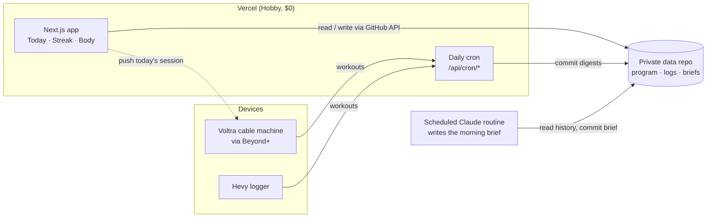

# Lift

A personal strength coach that plans each training day before you wake up, and a
phone-first web app to run it from.

Lift started from one observation: training consistency doesn't break, it erodes.
Several good months turned into roughly 15% fewer sessions a month, which nobody
noticed until training had stopped completely. So the system is built around two
things: catching that drift early, and making real progress visible enough to keep
going.

## How it works



1. **06:00.** Vercel Cron pulls recent workouts from Hevy and the Voltra API and
   commits a compact digest to the data repo.
2. **07:00.** A scheduled Claude routine reads the program, the exercise library,
   injury constraints and the digests, and writes the day's brief: which session,
   why, at what loads. The brief has a prose part and a JSON part that follows
   [a documented schema](docs/brief-schema.md).
3. **At the gym.** The app shows the session, lets you swap variants (full,
   minimum, traveling, can't train), and hands off to the logger.
4. **Always.** The Streak card counts distinct training days against a weekly
   target, and a Strength Index tracks estimated 1RM across four anchor lifts.

## Design decisions

- **Git as the database.** The data is small and mostly written once a day, and
  the routine already works through git. Every change is a readable, revertible
  commit, and there's nothing to run or pay for. See the
  [architecture review](docs/audits/architecture-audit.md) for the trade-offs and
  the point at which this should move to a real database.
- **Code public, data private.** The app reads and writes a separate private repo
  using a fine-grained token scoped to that repo only, so nothing holding the
  runtime credentials can push to the code that production deploys from.
- **Measured over typed.** Where the Voltra measures something (force, velocity per
  rep), it beats a number typed into a logger afterwards.
- **Computed, not stored.** Streaks and strength numbers are derived from the logs
  on every read, so they can't drift from what actually happened.
- **$0 a month.** Vercel Hobby, GitHub Actions and the device's free companion app.

## Security model

Single user, so no accounts. The secret is typed into `/login` once per device and
exchanged for a signed, year-long session cookie. The cookie is an HMAC-signed session,
not the secret, and bumping `SESSION_VERSION` signs every device out. The gate fails
closed if the secret is unset.

- **Every route checks the session itself.** The `proxy.ts` gate isn't the only check,
  so a matcher mistake fails closed.
- **Two public routes:** `/api/health` (returns `{ ok: true }` and nothing else) and the
  cron routes (which check their own bearer secret, in constant time).
- **Cross-site requests that change state are refused** (`Sec-Fetch-Site` / `Origin`).
- **A per-request nonce Content Security Policy** means only scripts the app rendered
  can run.
- **The model-written brief is checked twice.** Its JSON is shape-checked and bounded
  before anything renders or pushes it. Its Markdown goes through a small renderer that
  escapes everything and allows only `https:` links, with regression tests for injection.
- **Errors never echo third-party responses to the browser.** Details stay in the logs.

## Running it

```bash
cd web
cp .env.example .env.local   # fill in: see the comments for each variable
npm ci
npm test                     # unit tests on synthetic fixtures, no credentials needed
npm run dev
```

The app needs a data repo to read from (`DATA_REPO`, `DATA_TOKEN`). Its layout is:
`program/`, `library/exercises.yaml`, `athlete/`, `logs/briefs/`, `logs/hevy/`,
`logs/voltra/`, `logs/bodyweight.csv`.

## Layout

```
web/                 Next.js app (App Router), API routes, crons
  lib/metrics.ts     streak and strength-index computation
  lib/markdown.ts    brief renderer (the trust boundary for model output)
  test/              unit tests on synthetic fixtures
scripts/             Python: program validation, Hevy routine sync
docs/                brief schema, architecture review
```

## License

MIT
