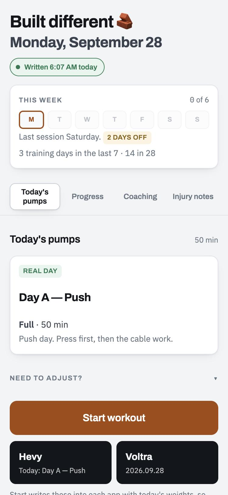
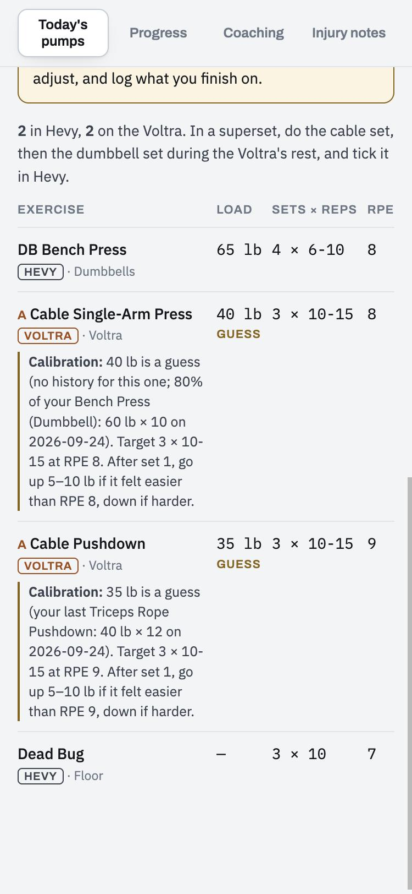
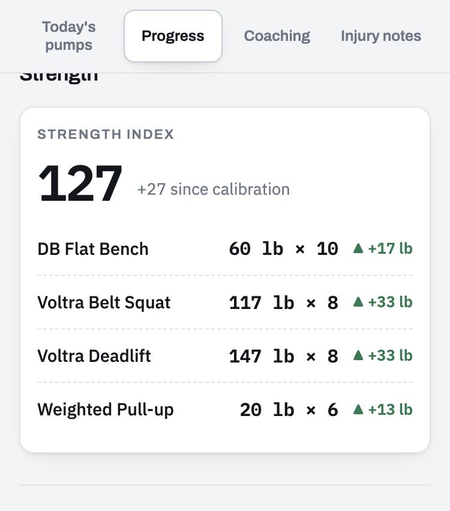
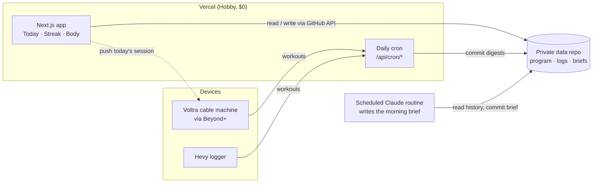

# Lift

A personal strength coach that plans each training day before you wake up, and a
phone-first web app to run it from.

Lift started from one observation: training consistency doesn't break, it erodes.
Several good months turned into roughly 15% fewer sessions a month, which nobody
noticed until training had stopped completely. So the system is built around two
things: catching that drift early, and making real progress visible enough to keep
going.

<p>
  
  
  
</p>

<sub>Screenshots from the demo (<code>npm run demo</code>), which runs on made-up data.</sub>

## How it works



1. **06:00.** Vercel Cron pulls recent workouts from Hevy and the Voltra API and
   commits a compact digest to the data repo.
2. **07:00.** A scheduled Claude routine reads the program, the exercise library,
   injury constraints and the digests, and writes the day's brief: which session,
   why, at what loads. The brief has a prose part and a JSON part that follows
   [a documented schema](docs/brief-schema.md).
3. **At the gym.** The app shows the session and lets you swap variants (full,
   minimum, traveling, can't train). **Start** writes today's routine into Hevy and
   today's session onto the Voltra, with the weights, so both are waiting. **End**
   pulls the finished work back in.
4. **Always.** The week strip counts distinct training days against a weekly
   target, and a Strength Index tracks estimated 1RM across four anchor lifts.

## Design decisions

- **Git as the database.** The data is small and mostly written once a day, and
  the routine already works through git. Every change is a readable, revertible
  commit, and there's nothing to run or pay for. See the
  [architecture review](docs/audits/architecture-audit.md) for the trade-offs and
  the point at which this should move to a real database.
- **Code public, data private.** The app reads and writes a separate private repo
  using a fine-grained token scoped to that repo only, so nothing holding the
  runtime credentials can push to the code that production deploys from.
- **Measured over typed.** Where the Voltra measures something (force, velocity per
  rep), it beats a number typed into a logger afterwards.
- **Computed, not stored.** Streaks and strength numbers are derived from the logs
  on every read, so they can't drift from what actually happened.
- **$0 a month.** Vercel Hobby, GitHub Actions and the device's free companion app.

The reasoning behind each is written up as a short
[architecture decision record](docs/adr/README.md).

## Security

Single user: one secret, exchanged for a signed session cookie; every route checks it;
a per-request-nonce CSP; the model-written brief is treated as untrusted input. The full
model, and how to report a problem, is in [SECURITY.md](SECURITY.md).

## Running it

**Try it with no credentials.** The demo runs the whole app on made-up data, read-only:

```bash
cd web
npm ci
npm run demo                 # http://localhost:3100, password: demo
```

**Against your own data repo:**

```bash
cd web
cp .env.example .env.local   # fill in: see the comments for each variable
npm run dev
```

The app reads a data repo (`DATA_REPO`, `DATA_TOKEN`) laid out like
[`web/test/fixtures/data`](web/test/fixtures/data): `program/`, `library/`, `scripts/`
mappings, and `logs/`. Point `DATA_DIR` at a local folder instead to skip GitHub entirely.

**Checks** (the same ones CI runs):

```bash
npm run check                # typecheck, lint, format check, all tests
```

The tests use synthetic data only. The route tests run the real API handlers against a
temporary copy of the fixture data repo, with no network.

## Layout

```
web/                    Next.js app (App Router), API routes, crons
  lib/store.ts          the one door to the data: GitHub, or a local folder
  lib/metrics.ts        streak and strength-index computation
  lib/loadGuess.ts      calibration loads when the brief leaves one out
  lib/markdown.ts       brief renderer (the trust boundary for model output)
  test/                 unit and route tests; fixtures/data is a synthetic data repo
  scripts/demo-data.mjs builds the demo's made-up data
scripts/                Python: rebuilds the program's routines in Hevy (run by hand)
docs/adr/               architecture decision records
docs/                   brief schema, architecture review, screenshots
```

## License

MIT
