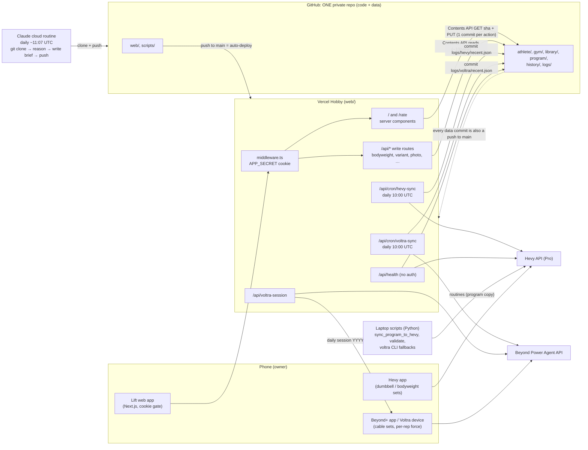
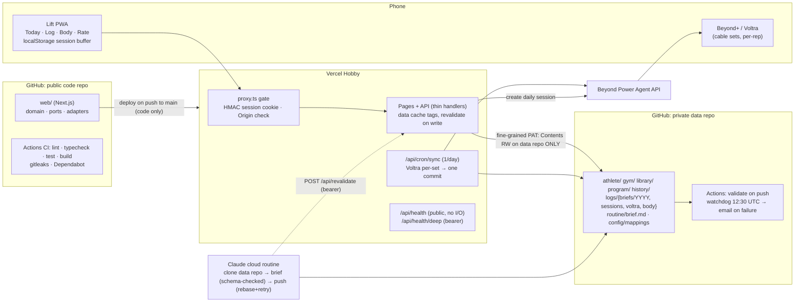

# Architecture Audit — personal-trainer

**Date:** 2026-09-27  
**Scope:** entire repository (`web/`, `scripts/`, YAML data, `logs/`, `history/`, docs), full git history (66 commits, all branches), runtime configuration (`web/vercel.json`, `web/middleware.ts`), and the operational write pattern (cron + cloud routine + in-app commits).  
**Method:** static review of every source file; `npm ci`, `tsc --noEmit`, `npm test`, `next build`, `npm audit` and `python3 scripts/validate.py` run in a scratch copy; pattern scan of the full `git log -p` for credentials and personal data; review of phone screenshots of the live workflow (Hevy + Beyond+).  
**Constraints honoured:** $0/month beyond the current Hevy Pro subscription, fewest possible tools, public-code / private-data split.

---

## 1. Executive summary

This is a thoughtfully designed single-user system. The code is small (~2.1k lines TS/TSX, ~1.1k lines Python), well commented with *why* rather than *what*, fails closed on missing secrets, and makes deliberate, documented trade-offs (flat files over a database, one secret per place, text-preserving YAML edits). Build, typecheck, tests and data validation all pass.

The weaknesses are the ones typical of a system that grew quickly from a spike:

1. **Code and personal data share one repository, and the app's write token can modify both.** A leaked `GITHUB_TOKEN` (or a compromised npm dependency reading `process.env`) can push code to `main`, which auto-deploys to production. This also blocks going public: name, date of birth, injury/health notes, bodyweight, three years of training history, and data-bearing commit messages are all in history.
2. **Failures are silent.** Cron errors go to `console.error` only; the sync timestamps are loaded but never shown; nothing notices when the cloud routine doesn't run. The coach can write tomorrow's brief from stale data and nobody finds out.
3. **GitHub-as-database is fine for the volume, but it is used naively**: ~10 uncached API calls per page view, read-modify-write without conflict retry, and a directory listing that will silently truncate at 1,000 entries in roughly 16 months.
4. **The logging workflow is split across three apps** (this app, Hevy, Beyond+). Evidence from the code and the live screenshots says Hevy has become a static, lossy copy of a plan the app already holds in richer form. Recommendation: replace it with an in-app set logger and cancel Hevy Pro (verdict in §3.2).
5. **Duplicated logic across TypeScript and Python** has already drifted (different top-set selection in the two Hevy digests).

### Overall grade: **B−**

| Dimension | Grade | One-line rationale |
|---|---|---|
| Design intent & documentation | A− | Decisions and trade-offs are written down; comments explain *why*. |
| Reliability / SPOF | C | Single token, single data store, no alerting, no retry. |
| Scalability (for its real load) | B− | Volume is tiny; the risks are API-call fan-out, listing caps and commit contention, not data size. |
| Security | C+ | Fail-closed gate and least-exposure health endpoint show care; token scope, the public health endpoint, cookie design and one verified XSS path need work. |
| Clean architecture / testability | C+ | Domain logic is mixed into route handlers; I/O is hard-wired; tests depend on personal data. |
| Public-portfolio readiness | D | Personal data in tree and history; no CI, LICENSE, lint, `.env.example` or architecture diagram. |

### P0 — do these before the repo goes public

| ID | Title | Effort |
|---|---|---|
| **SEC-1** | Personal/health data and identifiers across the tree, history and commit messages → split repos, fresh public history | M |
| **SEC-2** | The app's write token can modify the repo Vercel deploys from → token compromise = production code push | S (after split) |
| **SEC-3** | Unauthenticated `/api/health` exhausts the GitHub quota for the whole app and leaks activity metadata | S |
| **SPOF-1** | Sync and brief failures are silent; staleness is never shown | S |

---

## 2. Current architecture



### Data flow (a normal day)

1. **~10:00–10:59 UTC** — Vercel Cron calls both sync routes (same schedule; Hobby crons fire anywhere within the hour). Each pulls its vendor API, builds a compact digest and commits it via the Contents API (`GET` for the sha, then `PUT`). Two commits per day.
2. **~11:07 UTC** — The Claude cloud routine clones the repo, reads program + library + injuries + digests + app logs, writes `logs/briefs/YYYY-MM-DD.{md,json}`, runs validation, commits and pushes. Its prompt is **not in the repo** (only its trigger id is recorded in `PLAN.md`).
3. **Morning** — The phone opens the app. `loadDay()` (`web/lib/brief.ts:50-133`) makes 8 parallel Contents API calls, then 2 more for the brief. Nothing is cached (`cache: "no-store"` everywhere, `dynamic = "force-dynamic"`).
4. **During the session** — The owner opens the Hevy routine (a static copy of the program pushed by `scripts/sync_program_to_hevy.py`) for dumbbell/bodyweight work, and the Beyond+ session (created by `/api/voltra-session`) for cable work. Every tap on a variant, bodyweight entry, rest day, rating, measurement or photo is **one commit to `main`**.
5. **Commit volume** — Of the 50 most recent commits, 16 are variant taps, 8 are briefs, 8 are syncs; in total about 60% of history is machine-written data. On 2026-09-26 five variant commits landed within 4 seconds.

---

## 3. Toolchain and cost inventory

### 3.1 Inventory

| # | Tool / service | Role today | Cost | Recommendation |
|---|---|---|---|---|
| 1 | **GitHub (repo)** | Source code **and** database for all data | Free | **Keep, split into two repos** (public code, private data) |
| 2 | **GitHub Contents API** | Read/write path for the app and crons | Free (5,000 req/h per token; secondary limits ~80 content-creating req/min, 500/h) | **Keep**, with caching, conflict retry and a narrowly scoped token |
| 3 | **GitHub Actions** | Not used | Free (unlimited for public repos; 2,000 min/month private) | **Add**: CI in the public repo; validate + freshness watchdog in the data repo |
| 4 | **Vercel Hobby** | Hosting, env secrets, 2 daily crons | $0 | **Keep.** Hobby limits that matter: crons run **at most once a day** with hourly precision; request body **4.5 MB**; function duration 60 s legacy / up to 300 s with Fluid compute; ~100 deployments/day; **non-commercial use only** (a portfolio project is fine; monetising it is not) |
| 5 | **Next.js 16 / React 19 / TypeScript** | App framework | Free | **Keep** |
| 6 | **Hevy Pro** | Logger for dumbbell/bodyweight work; routines; API for sync | Paid (about $24/yr annual or about $75 lifetime at list price; check current pricing) | **Drop, in phases** (see 3.2) |
| 7 | **Beyond+ / Voltra Agent API** | Device logger (per-set and per-rep force, velocity, power, rest); daily session push | Free with device | **Keep.** It is the authoritative logger for cable work |
| 8 | **`voltra` CLI** (`~/.voltra/bin/voltra`) | Used by `voltra_digest.py`, `voltra_session.py` | Free | **Drop** from the toolchain: the app already calls the HTTPS API directly; the Python copies duplicate it |
| 9 | **Claude cloud routine** | Writes the daily brief | Covered by the existing Claude plan | **Keep**; version its prompt in the data repo; point it at the data repo |
| 10 | **Python 3 + PyYAML** | `validate.py`, program→Hevy sync, Juggernaut baseline, local fallbacks | Free | **Consolidate**: delete the 3 duplicate digest/session scripts now; port `validate.py` to TS (Month 1); `sync_program_to_hevy.py` goes when Hevy goes; archive `baseline_from_juggernaut.py` as a one-off |
| 11 | **Juggernaut AI** | Legacy history (CSV export, 4,185 rows) | Cancelled or cancellable | **Drop** the service; keep the CSV in the **data** repo |
| 12 | Local scheduled task (desktop) | Superseded by the routine | — | **Already dropped**; remove references |
| 13 | Cronometer / Apple Health / Whoop | Deferred or dropped | — | Nothing to do |

**Net target toolchain:** GitHub (2 repos + Actions) · Vercel Hobby · Beyond+ · Claude routine. **$0/month** once Hevy Pro lapses.

### 3.2 Hevy verdict: **drop it, once the app can log sets (Month 1). Keep paying until then.**

Evidence from the code:

- **Hevy holds a static copy of a plan the app already holds in better form.** `sync_program_to_hevy.py` pushes one routine per program day, re-run only when `program/current.yaml` changes. The daily brief JSON (`docs/brief-schema.md`) already carries today's variant, sets × reps, RPE, station and a **`load_lb` per row**. In the screenshots, the Hevy routine's load column is blank ("–") because Hevy never gets the daily loads. The Hevy routine is the less accurate of the two plans.
- **Coaching intent is being stuffed into free-text notes.** RPE, station and progression rules show up as Hevy exercise notes ("RPE 8 — [nuobell] — ANCHOR…"), and the routine carries the note "1 Voltra exercise(s) NOT listed here". A single session is split by hand across two loggers.
- **The app has to work out which Hevy routine to open** (`web/app/Today.tsx:39-49` parses "promote to Day E" out of prose), because Beast-mode variants don't map onto Hevy's static routines. That logic exists only to cover the mismatch.
- **Hevy has little history to lose.** `logs/hevy/recent.json` reports **22 workouts in total**; the deep history is the Juggernaut CSV.
- **Hevy is a data-quality risk.** A workout left open for 16 h+ (timer seen in a screenshot) is not returned by `/v1/workouts` until it is finished. So the 07:07 brief sees a *missed day*, and the eventual record has a bogus duration. See DQ-1.
- **How much it pulls in:** removing Hevy deletes `lib/hevy.ts`, `/api/cron/hevy-sync`, `/api/refresh`'s Hevy path, `scripts/hevy_api.py`, `hevy_digest.py`, `hevy_recent.py`, `sync_program_to_hevy.py`, `hevy_mapping.yaml`, the routine-name heuristics, and the `HEVY_API_KEY` secret. That is roughly 700 lines, one cron and one secret.

What would replace it: a **"Log" mode** on the Today screen. It renders today's variant rows as a checklist, pre-fills weight and reps from `load_lb` and the last logged set, and records actual weight/reps/RPE per set. It buffers to `localStorage`, so it works on patchy gym Wi-Fi and survives reloads, and commits **one file per session** (`logs/sessions/YYYY-MM-DD.json`) when you tap Finish. Voltra rows are marked "logged on device" and joined from the Beyond+ sync, which already has per-set truth.

What you give up: Hevy's polish (exercise demo images, lock-screen rest timer, watch app) and its offline-first native app. The rest timer is a 30-line client component. The rest are nice-to-haves.

Plan: build Log mode → run both in parallel for 2 weeks → export Hevy history once into `history/hevy-export.json` in the data repo → cancel Pro at renewal. **Where the money goes:** on the $0 goal, bank it. If you want to spend it on the LinkedIn goal instead, about $12/yr buys a custom domain, so the portfolio link isn't a `*.vercel.app` URL.

If you'd rather keep Hevy, the cheapest honest option is the one-time lifetime tier (ongoing cost goes to $0). Also fix DQ-1 and stop pushing coaching notes into Hevy.

---

## 4. Findings

Priority key: **P0** = before going public, or an active integrity risk · **P1** = next month · **P2** = hygiene.
Effort: **S** < ½ day · **M** 1–3 days · **L** > 3 days.

### 4.1 Single points of failure and data integrity

#### SPOF-1 (P0) — Failures are silent
- **Evidence:** `web/app/api/cron/hevy-sync/route.ts:82-85` and `voltra-sync/route.ts:69-72` only `console.error`. `web/lib/brief.ts:123-126` loads `hevySyncedAt`, `voltraSyncedAt` and `voltraUnnamed`, but no component renders them. `/api/health` checks neither sync freshness nor `VOLTRA_API_KEY`. Nothing observes whether the cloud routine ran; `Freshness.tsx` covers only the brief date.
- **Impact:** an expired token, a vendor API change or a failed routine produces a plausible-looking brief built on stale data. Given the system's purpose (catching decay early), a quietly wrong coach is the worst failure mode.
- **Recommendation (all $0):**
  1. Show a staleness chip when `hevySyncedAt`/`voltraSyncedAt` is older than 26 h, or `voltraUnnamed > 0`.
  2. Add a **watchdog GitHub Actions workflow in the data repo**, scheduled at about 12:30 UTC. It fails if today's brief or either digest is missing or stale. GitHub emails you on workflow failure, so you get alerting without adding a service.
  3. Have cron routes return non-2xx on failure (they already do) and also write `logs/_status.json` with `{source, ok, at, error}` so the app and the routine can see the last error.
  ```yaml
  # data repo: .github/workflows/watchdog.yml
  on: { schedule: [{ cron: "30 12 * * *" }], workflow_dispatch: {} }
  jobs:
    freshness:
      runs-on: ubuntu-latest
      steps:
        - uses: actions/checkout@v4
        - run: |
            d=$(TZ=America/New_York date +%F)
            test -f "logs/briefs/$d.md"   || { echo "::error::no brief for $d"; exit 1; }
            for f in logs/hevy/recent.json logs/voltra/recent.json; do
              jq -e --arg d "$d" '.local_date == $d' "$f" >/dev/null || { echo "::error::$f stale"; exit 1; }
            done
  ```
- **Effort:** S

#### SPOF-2 (P1) — One token, one store, no degradation path
- **Evidence:** `web/lib/github.ts:13-24`. Every read, write and cron depends on one `GITHUB_TOKEN`. When GitHub or the token fails, `page.tsx:24-33` renders "Couldn't reach the repo" with the raw error.
- **Impact:** a token expiry (fine-grained PATs expire) or a GitHub incident takes the whole app down, including the ability to see today's session in the gym.
- **Recommendation:** (a) Read the `github-authentication-token-expiration` response header and surface "token expires in N days" in the authenticated health view and the watchdog. (b) Keep a last-known-good snapshot: cache the `loadDay()` result with `unstable_cache`/`fetch` tags (see SCL-1), so a GitHub error serves the previous render with a banner. (c) Client-side, keep today's brief in `localStorage` so the session is visible offline. (d) Put a calendar reminder at token expiry minus 14 days.
- **Effort:** S–M

#### SPOF-3 (P1) — Write contention: read-modify-write with no retry, same-minute crons, concurrent git pushes
- **Evidence:** `writeFile()` does `GET sha` then `PUT` (`web/lib/github.ts:45-61`) with no handling for 409/422. `Today.tsx:62-66` fires a commit on **every variant tap** and swallows errors (`.catch(() => {})`); history shows 5 variant commits in 4 s on 2026-09-26. Both crons share `"0 10 * * *"` (`web/vercel.json`). The routine pushes with git while the app commits through the API.
- **Impact:** lost variant choices (silently), intermittent 500s on bodyweight/rest-day saves, and a rejected routine push (non-fast-forward) if an app commit lands between its clone and push. The last one is the likeliest way to lose a brief.
- **Recommendation:**
  ```ts
  // lib/store/github.ts: optimistic concurrency with bounded retry
  export async function updateFile(path: string, fn: (old: string | null) => string, msg: string) {
    for (let attempt = 0; attempt < 4; attempt++) {
      const { text, sha } = await readWithSha(path);           // null sha if missing
      const next = fn(text);
      if (next === text) return { changed: false };
      const res = await put(path, next, msg, sha);
      if (res.ok) return { changed: true };
      if (res.status !== 409 && res.status !== 422) throw await httpError(res);
      await sleep(150 * 2 ** attempt + Math.random() * 100);   // re-read and re-apply
    }
    throw new Error(`conflict writing ${path}`);
  }
  ```
  Callers pass a pure transform (`rows => upsertByDate(rows, today, value)`), which also makes the domain logic unit-testable. Debounce the variant log client-side: record the final choice when the session is started or after 30 s idle. Merge the two crons into **one** `/api/cron/sync` that writes both digests in **one commit** using the Git Data API (create blobs → tree → commit → update ref), which removes the same-minute race. Put "`git pull --rebase` and retry up to 3× on push rejection" in the routine prompt.
- **Effort:** M

#### SPOF-4 (P1) — Third-party dependence with no timeouts
- **Evidence:** `lib/hevy.ts:16-22` and `lib/voltra.ts:21-38` call `fetch` with no `AbortSignal.timeout`. The Voltra response shape is guessed (`d?.list ?? d?.data?.list ?? []`, `voltra.ts:61-62`), so a shape change returns `[]` and **commits an empty digest over good data**.
- **Impact:** a hung vendor call burns the whole function budget. A silent shape change wipes the coach's view of recent training.
- **Recommendation:** `signal: AbortSignal.timeout(10_000)` on every outbound call. Validate vendor responses with a schema, and **refuse to overwrite a non-empty digest with an empty one** unless the count endpoint agrees.
- **Effort:** S

#### DQ-1 (P1) — Split-brain logging and metric quality
- **Evidence:** one session spans two loggers (see §3.2). An unfinished Hevy workout is invisible to `/v1/workouts` until it is finished (a 16 h open timer was observed). `mergeSources()` (`web/lib/metrics.ts:59-77`) uses **max pull force** as the "load" for Voltra sets and feeds it into the same e1RM formula as typed dumbbell weights. The Voltra digest keeps only session aggregates, although Beyond+ exposes per-set base weight, reps, velocity and rest (`docs/voltra-cortex.md`).
- **Impact:** the Strength Index mixes a peak-force measurement with a prescribed load, so Voltra anchors are inflated and velocity-sensitive. Missed-day detection can misfire on an open workout.
- **Recommendation:** sync per-set Voltra data (`/workout/sets` equivalent) and use **base weight × reps** for e1RM, keeping force/velocity as separate trend lines. With in-app logging (§3.2) the open-workout problem disappears. Until then, flag Hevy workouts whose duration is over 4 h.
- **Effort:** M

### 4.2 Scalability and performance

The data volume is tiny (a few thousand rows a year) and will not stress anything. The real limits are API fan-out, listing caps, build triggers and function time.

#### SCL-1 (P1) — Every page view makes ~10 uncached GitHub API calls
- **Evidence:** `web/lib/brief.ts:53-84` (8 parallel + 2 serial reads); `cache: "no-store"` in `lib/github.ts:28,37`; `export const dynamic = "force-dynamic"` on pages.
- **Impact:** about 0.5–1.5 s time-to-first-byte from GitHub latency alone, and 10 quota units per view. Harmless at one user; it matters combined with SEC-3.
- **Recommendation:** use Next's data cache with tags and invalidate on write:
  ```ts
  const res = await fetch(url, { headers, next: { tags: ["data"], revalidate: 300 } });
  // after any successful write in a route handler:
  import { revalidateTag } from "next/cache"; revalidateTag("data");
  ```
  The routine's pushes won't invalidate the cache, so either keep `revalidate` short (300 s) or have the routine call a `CRON_SECRET`-protected `/api/revalidate` after pushing. Alternatively use conditional requests (`If-None-Match`): 304 responses don't count against the rate limit.
- **Effort:** S

#### SCL-2 (P1) — Directory listing will silently truncate in ~16 months
- **Evidence:** `listDir("logs/briefs")` (`brief.ts:54`, `health/route.ts:45`). The Contents API returns at most **1,000 entries** per directory, and briefs add 2 files a day (730/yr).
- **Impact:** around January 2028 the newest brief stops appearing and the app shows an old one as "latest". The same applies to `logs/photos` over a longer horizon.
- **Recommendation:** shard by year (`logs/briefs/2026/2026-09-27.md`), or read the brief by today's date directly and fall back through the last N dates, or use the Git Trees API (`GET /git/trees/{sha}?recursive=1`, up to 100k entries).
- **Effort:** S

#### SCL-3 (P1) — Hevy sync walks the whole history, sequentially, with a silent cap
- **Evidence:** `lib/hevy.ts:28-38`: up to 30 sequential pages of 10 to keep 40 sessions; `workout_count` is computed from the truncated list.
- **Impact:** sync time grows with history (about 300 ms per page); after 300 workouts `workout_count` is wrong without any warning.
- **Recommendation:** fetch 4 pages (newest first) and use `/v1/workouts/count` for the total. (Moot if Hevy is dropped.)
- **Effort:** S

#### SCL-4 (P1) — Data commits trigger production builds
- **Evidence:** the README says it "auto-deploys on push to `main`". `web/vercel.json` has no `ignoreCommand`, and every app action pushes to `main` (16 variant commits in one day).
- **Impact:** wasted builds, possible collisions with the Hobby deployment cap, and build-queue noise that hides real deploys. Unless an Ignored Build Step is set in the dashboard (it isn't in the repo), each bodyweight entry rebuilds the site.
- **Recommendation:** the repo split removes this completely. As a stopgap: `"ignoreCommand": "git diff --quiet HEAD^ HEAD -- ."` in `web/vercel.json`, with the Vercel root directory set to `web/`.
- **Effort:** S

#### SCL-5 (P2) — Photo size limits are inconsistent
- **Evidence:** `api/photo/route.ts:22-24` allows 4,000,000 decoded bytes, but base64 in JSON is about 5.3 MB, above Vercel's 4.5 MB request-body limit.
- **Impact:** large photos fail at the platform with an opaque 413 before the route's own error message can run.
- **Recommendation:** cap at 3 MB decoded (the client already downscales to about 1200 px JPEG, typically under 400 KB), or upload as `multipart/form-data`.
- **Effort:** S

### 4.3 Security

#### SEC-1 (P0) — Personal and health data throughout the tree, history and commit metadata
- **Evidence (types only):** full name and date of birth (`athlete/profile.yaml`, since `c89dc8e`); injury/health constraints (`athlete/injuries.yaml`, from the first commit); bodyweight series (`logs/bodyweight.csv`); 3-year training log (`history/juggernaut-2023-2026.csv`, `d07574e`); free-text workout notes (`logs/hevy/recent.json`); coaching briefs discussing health; **commit messages carrying data** (e.g. "Bodyweight <date>: <n> lb"); personal email as author on 58 commits; production URL in `README.md` (since `c30e45f`); cloud-routine trigger id in `PLAN.md` (since `5500da0`).
- **Impact:** publishing this repo, or any history derived from it, discloses health data permanently. Rewriting history with filter-repo is error-prone because of the commit messages and metadata.
- **Recommendation:** two repos, **fresh history** for the public one (see §6). Never make the current repository public.
- **Effort:** M

#### SEC-2 (P0) — The runtime token can rewrite the deployed code
- **Evidence:** `GITHUB_TOKEN` must have Contents write on the repo that contains `web/`, and Vercel auto-deploys `main`.
- **Impact:** anything that can read the function's environment (a compromised dependency, a leaked token, a future SSRF) can push arbitrary code to production. This is the highest-leverage attack path in the system.
- **Recommendation:** after the split, use a **fine-grained PAT** scoped to **only the private data repo**, with Contents read/write, Metadata read-only (mandatory) and nothing else, and a set expiry. The code repo is then unwritable from runtime. Protect `main` in the public repo (require PR + CI). Alternative with better hygiene but more setup: a GitHub App installed on the data repo only, minting 1-hour installation tokens.
- **Effort:** S (after split)

#### SEC-3 (P0) — Unauthenticated `/api/health` amplifies requests and discloses metadata
- **Evidence:** `middleware.ts:57` exempts `api/health`; `health/route.ts:36-62` performs 2 GitHub calls and 1 Hevy call per request, and returns latest brief date, `hasBriefForToday`, Hevy workout count, and token length and type.
- **Impact:** about 1,700 anonymous requests an hour exhaust the 5,000/h token quota, which takes down the app and the crons (a cheap DoS). The metadata shows training activity (whether today's brief exists, workout count). Once the source is public and the URL is known, discovering this is trivial.
- **Recommendation:** split into `/api/health` (public: `{ ok: true }`, no outbound calls) and `/api/health/deep` (requires `Authorization: Bearer $CRON_SECRET` or the auth cookie) that returns the current diagnostics. Remove the production URL from the README; if you want it on LinkedIn, put a demo instance with synthetic data behind a separate link.
- **Effort:** S

#### SEC-4 (P1) — Stored XSS via Markdown link attribute injection (verified)
- **Evidence:** `web/lib/markdown.ts:9-21`. `esc()` doesn't escape `"`, and the link regex accepts `"` inside the URL. Input `[x](https://a"onmouseover="alert(1))` renders `<a href="https://a"onmouseover="alert(1">`. The output goes into `dangerouslySetInnerHTML` (`Coaching.tsx:37,41`).
- **Impact:** the brief is LLM-written from inputs that include free text (Hevy notes, injury notes, rest-day reasons), so a prompt-injected or malformed brief can run script in the authenticated origin and call every write API. The cookie is httpOnly, but that doesn't stop same-origin requests.
- **Recommendation:** escape `"` and `'` in `esc()`; build `href` with `encodeURI` and allow only `https:`; add `rel="noopener noreferrer"`. Add a strict CSP header in `next.config.ts` (`script-src 'self'`). Add a regression test.
- **Effort:** S

#### SEC-5 (P1) — The session cookie is the master secret
- **Evidence:** `middleware.ts:30` sets `pt_auth = APP_SECRET` for one year. The secret enters through `?k=` (it appears in the Vercel request log and briefly in browser history before the redirect). There is no rotation or revocation other than changing the secret. Cron auth uses a plain `!==` (`cron/*/route.ts:25,21`).
- **Impact:** a lost or stolen phone, or a log exposure, gives indefinite access; rotating means re-bootstrapping every device.
- **Recommendation:** store a derived, versioned token instead: `cookie = v1.<issuedAt>.<HMAC(APP_SECRET, "v1."+issuedAt)>` and verify with a constant-time compare (Web Crypto `crypto.subtle.verify` in middleware). A `SESSION_VERSION` env bump then revokes all cookies without touching the bootstrap secret. Use a timing-safe compare for `CRON_SECRET`. Make the bootstrap a POST form instead of `?k=` so the secret never appears in a URL. Rotate `APP_SECRET` and `CRON_SECRET` when you go public.
- **Effort:** S

#### SEC-6 (P1) — Middleware is the only auth layer
- **Evidence:** no route checks auth itself. The matcher's negative lookahead is **prefix-based** (`middleware.ts:57`), so any future path starting with `api/health` or `api/cron` (e.g. `/api/cron-admin`, `/api/healthz`) is unauthenticated by accident. Next.js has had a middleware-bypass advisory before (CVE-2025-29927), and Next 16 now warns that `middleware` is deprecated in favour of `proxy` (seen in the build output).
- **Recommendation:** add a `requireAuth(req)` helper called at the top of every mutating route (defence in depth). Anchor the matcher: `api/health(?:/|$)`, `api/cron/`. Run `npx @next/codemod middleware-to-proxy`. Keep Next pinned and patched (Dependabot).
- **Effort:** S

#### SEC-7 (P1) — CSRF and state-changing GET
- **Evidence:** `/api/refresh` is a `GET` that commits (`refresh/route.ts:18`). `SameSite=Lax` sends cookies on top-level cross-site GET navigations, so a link can trigger it. POST routes rely only on `SameSite=Lax`.
- **Recommendation:** make refresh a POST. In middleware, reject non-GET requests whose `Origin` header isn't the app's own origin.
- **Effort:** S

#### SEC-8 (P1) — Input validation gaps for LLM-produced data
- **Evidence:** `BriefData` is cast, not validated (`voltra-session/route.ts:73`; `brief.ts:82`). A row without `name` throws at `row.name.toLowerCase()` (`voltra-session/route.ts:93`). The `date` body parameter goes into a path unvalidated (`voltra-session/route.ts:63,66`); the effect is limited to reading other repo paths ending in `.json`, but it's still unvalidated. Photo content isn't checked against magic bytes.
- **Recommendation:** add a single `zod` schema for the brief (and generate `docs/brief.schema.json` from it for the routine and the data-repo CI). Validate `date` with `/^\d{4}-\d{2}-\d{2}$/`. Check JPEG/PNG/WebP signatures.
- **Effort:** S–M

#### SEC-9 (P1) — Dependency hygiene
- **Evidence:** `npm audit`: **1 moderate** — `yaml` 2.6.1 (GHSA-48c2-rrv3-qjmp, stack overflow on deeply nested YAML; fixed in ≥ 2.8.3/2.9.x). `next` uses a caret range (`^16.3.5`) while everything else is exact-pinned. There's no Dependabot, and no `engines` field.
- **Recommendation:** pin `yaml` to a patched exact version, pin `next` exactly, add `.github/dependabot.yml` (npm + GitHub Actions, weekly), and add `"engines": {"node": ">=22"}` plus `.nvmrc`.
- **Effort:** S

#### SEC-10 (P2) — Error responses leak internals
- **Evidence:** every route returns `{ error: String(err) }`, which includes GitHub response bodies (`lib/github.ts:30,59`). `page.tsx:30` renders the error.
- **Recommendation:** log the detail server-side with a request id; return `{ error: "write_failed", id }`.
- **Effort:** S

**Positive controls worth keeping:** fail-closed when `APP_SECRET` is unset; 404 rather than 401 so the app's existence isn't confirmed; the secret is stripped from the URL after bootstrap; `httpOnly` + `Secure` + `SameSite=Lax` on the cookie; token-shape diagnostics that never echo token material; client-side canvas re-encode of photos (which strips EXIF/GPS); `.gitignore` already covers `.env*`, `.*_api_key` and `secrets/`.

### 4.4 Clean architecture, testability, observability

#### ARCH-1 (P1) — Logic duplicated across TS and Python, and it has drifted
- **Evidence:** the Hevy digest exists **three** times (`api/cron/hevy-sync/route.ts:36-61`, `api/refresh/route.ts:23-47`, `scripts/hevy_digest.py:29-51`). Top-set selection differs: Python breaks weight ties by reps (`hevy_digest.py:34`), TS keeps the first (`hevy-sync/route.ts:42-46`). The Voltra digest exists twice, the Voltra session builder twice (`voltra-session/route.ts` vs `voltra_session.py`), `e1rm` twice, `flatten_library` four times, and the time zone is hardcoded in five places.
- **Recommendation:** one TS implementation per concern (`lib/sync/hevy.ts`, `lib/sync/voltra.ts`, `lib/domain/e1rm.ts`) called by both routes. Delete `hevy_digest.py`, `voltra_digest.py` and `voltra_session.py` (their "local fallback" role is covered by `curl -X POST` against the cron route with `CRON_SECRET`). Move the time zone to `athlete/profile.yaml` or an `APP_TIMEZONE` env var. The code comment says the owner trains "wherever he happens to be", which contradicts a hardcoded zone.
- **Effort:** S (delete) + M (consolidate)

#### ARCH-2 (P1) — No boundary between domain, I/O and transport
- **Evidence:** route handlers parse HTTP, read/write GitHub, and hold domain rules (CSV upsert, rolling average, variant log) inline. `OWNER`/`REPO` are hardcoded (`lib/github.ts:9-11`). Nothing can run without a live GitHub token.
- **Recommendation:** a small hexagonal layout:
  ```
  web/lib/
    domain/        pure: metrics, e1rm, bodyweight (upsert, rolling7), brief schema, tolerance, voltra-plan
    ports/         DataStore { read(path), list(dir), update(path, fn, msg), commit(files[], msg) }
    adapters/      github-store.ts (Contents + Git Data API), fs-store.ts (tests, local dev), hevy.ts, voltra.ts
    config.ts      env parsing (zod): DATA_REPO, DATA_BRANCH, APP_TIMEZONE, tokens
  web/app/api/*    thin: auth → parse → domain → store
  ```
  `FsStore` pointed at a fixtures directory gives you local development and integration tests with no credentials.
- **Effort:** M

#### ARCH-3 (P1) — Tests are thin and depend on personal data
- **Evidence:** 2 test files (117 lines). `library.test.mjs:23` reads `../../library/exercises.yaml`; `markdown.test.mjs` renders the real `logs/briefs`. Both shell out to `npx tsc` into `/tmp`. There are no tests for `metrics.ts`, `parseReps`, `resolveLoad`, CSV upsert or middleware; no lint config; no CI. Results in this audit: `tsc` clean, `npm test` passes (7 briefs, tolerance editor), `next build` passes (one deprecation warning), `validate.py` passes (45 exercises, 6 days).
- **Impact:** after the split these tests can't run in the public repo; the regression surface is untested.
- **Recommendation:** move to `node:test` or Vitest with `tsx`. Add **synthetic fixtures** under `web/test/fixtures/` (a sample library, 3 sample briefs, including a malicious-markdown case). Add unit tests for `computeMetrics`, `mergeSources`, `parseReps`, `resolveLoad`, `applyTolerances` and the bodyweight upsert. Add a middleware test for the cookie gate and matcher.
- **Effort:** M

#### ARCH-4 (P1) — The most important logic isn't in version control
- **Evidence:** the cloud routine's prompt, which is what actually produces the brief, exists only in the trigger configuration. The brief contract is prose (`docs/brief-schema.md`).
- **Recommendation:** store the prompt as `routine/brief.md` in the data repo and have the trigger's prompt say "follow `routine/brief.md`". Publish a JSON Schema for the brief from the zod schema. Add a data-repo CI job that validates every pushed brief and every YAML file (`validate.py`, or its TS port).
- **Effort:** S

#### ARCH-5 (P2) — Dead and misleading code
- `web/app/BodyweightForm.tsx` is unused (superseded by `Body.tsx`).
- `listActions()` in `lib/voltra.ts:67` is unused.
- `/api/voltra-session` has no caller in the UI (it was invoked out-of-band); either wire it to a button or document it.
- `scripts/hevy_api.py:157-170` has `DEFAULT_SNAPSHOT_PATH` pointing at a retired workspace folder; `hevy_recent.py:88` hardcodes a default date.
- `scripts/validate.py:98-103`: the "injury veto" loop iterates the prose rules but checks only library `tolerance == forbidden` and then `break`s. It never checks the program against injury rules, so the output reads as a stronger guarantee than it is. Either encode rules as structured data (`forbidden_patterns: [behind_neck, wide_pronated_pulldown]` matched against library tags) or rename the check.
- `next.config.ts` has an empty `experimental: {}`.
- **Effort:** S

#### ARCH-6 (P2) — Observability
- **Evidence:** no structured logs, no request ids, no record of which commit a sync produced.
- **Recommendation:** a 20-line `log()` helper that emits JSON (`{evt, route, ms, status, sha}`), visible in Vercel's runtime logs (Hobby retains them for a short window). Plus `logs/_status.json` (SPOF-1) as the durable signal.
- **Effort:** S

#### ARCH-7 (P2) — Documentation drift
- **Evidence:** the README says Phase 1 is "in progress" while `PLAN.md` says "done". `PLAN.md` says "No Vercel. No Supabase. No database." while Vercel is core. The README calls Hevy "the logger" while `metrics.ts` treats the device as authoritative.
- **Recommendation:** replace `PLAN.md`'s architecture section with ADRs (`docs/adr/0001-github-as-datastore.md`, `0002-single-shared-secret-auth.md`, `0003-split-public-code-private-data.md`, `0004-drop-hevy-for-in-app-logging.md`). Keep the personal plan in the data repo.
- **Effort:** S

#### ARCH-8 (P2) — Python tooling not reproducible
- **Evidence:** no `requirements.txt`/`pyproject.toml`; PyYAML is implicit. Scripts depend on `~/.voltra/bin/voltra` and a `.hevy_api_key` file at the repo root, so the laptop dependency survives for program sync.
- **Recommendation:** if any Python stays, add `pyproject.toml` with pinned `pyyaml`, `ruff` for lint and format, and a `DATA_DIR` env var (default `../personal-trainer-data`). Preferred: port `validate.py` (125 lines) to TS so the public repo is single-language, with Python kept only for the archived Juggernaut importer.
- **Effort:** S–M

---

## 5. Target architecture ($0/month)



**What changes:** two repos; a token that can't touch code; one cron and one commit per day; Hevy replaced by the in-app Log; per-set Voltra data; cached reads; an alerting path that costs nothing; the routine's logic under version control.

### Datastore decision: **keep GitHub (private data repo) as the datastore**

| Option (free tier) | Fit | Why not (now) |
|---|---|---|
| **GitHub data repo** ✅ | The routine already speaks git; human-readable YAML/CSV; full audit trail of every coaching change (an explicit requirement in `PLAN.md`); no new vendor or credential; volume is about 5k rows/yr | Latency and quotas (fixed by caching), no transactions (fixed by retry), no queries (not needed yet) |
| Vercel Blob | Good for photos | Blobs are addressable by URL (the privacy model needs care); still no queries; a second store to back up; the routine would need a new credential |
| Upstash Redis (formerly Vercel KV) | Fast key-value | Daily command caps, not relational, not human-readable; the routine needs a client + token; loses git history |
| Turso (libSQL) | Real SQL; generous free tier; no idle pausing | A new vendor and credential for both the app and the routine; loses the diffable audit trail. **This is the pick when the trigger below fires.** |
| Supabase / Neon Postgres | Full Postgres | Free Supabase projects pause after a week of inactivity (a travel week can trip it); heavier than needed; another console and set of secrets |

**Trade-offs accepted:** reads cost about 100–300 ms each before caching; eventual consistency with the routine (bounded by `revalidate` or the revalidate hook); commit history becomes the event log.

**Revisit trigger (a written rule, not a feeling):** move time-series data (`logs/sessions`, Voltra per-rep) to **Turso** when either (a) per-rep Cortex ingestion exceeds about 50k rows/yr, or (b) any query needs more than the last 90 days joined across sources. YAML config (program, library, athlete) stays in git permanently, because that's where review and diffs matter.

**Alternatives also considered and rejected:** moving crons to GitHub Actions (would be free, but adds a second place holding vendor secrets; Vercel Cron is sufficient at once a day); letting the routine call vendor APIs directly (it runs without the owner's secrets by design; keep "one secret, one place").

---

## 6. Public/private split plan

### 6.1 What goes where

| Path today | Public code repo (`<user>/lift-coach`, a new name is suggested) | Private data repo (`<user>/personal-trainer-data`) |
|---|---|---|
| `web/**` | ✅ (tests switched to fixtures) | ❌ removed after migration |
| `scripts/validate.py` (or its TS port) | ✅ reads `DATA_DIR` | — |
| `scripts/sync_program_to_hevy.py`, `hevy_api.py`, `hevy_recent.py` | ✅ until Hevy is dropped, then deleted | — |
| `scripts/hevy_digest.py`, `voltra_digest.py`, `voltra_session.py` | ❌ delete (duplicates, ARCH-1) | — |
| `scripts/baseline_from_juggernaut.py` | ✅ under `tools/archive/` with a synthetic sample CSV | — |
| `scripts/hevy_mapping.yaml`, `voltra_mapping.yaml` | `examples/config/` (sample) | ✅ `config/` (real, account-specific ids) |
| `docs/brief-schema.md` → `docs/brief.schema.json` | ✅ (sanitised: no names) | — |
| `docs/voltra-cortex.md` | ✅ sanitised (no local paths or personal references) | original |
| `docs/audits/architecture-audit.md` | ✅ (written to be publishable) | — |
| `README.md`, `PLAN.md` | new README + ADRs | originals (personal narrative, trigger id) |
| `athlete/**`, `gym/**`, `program/**`, `library/**` | `examples/data/` (synthetic athlete, generic library) | ✅ |
| `history/**` | — | ✅ |
| `logs/**` (briefs, digests, bodyweight, measurements, photos, notes, variants) | — | ✅ |
| cloud routine prompt | — | ✅ `routine/brief.md` (new) |

### 6.2 How the pieces reference the data repo

- **App env:** `DATA_REPO=<user>/personal-trainer-data`, `DATA_BRANCH=main`, `DATA_TOKEN=<fine-grained PAT>` (rename from `GITHUB_TOKEN` so it can't be confused with Actions' built-in token). `lib/config.ts` parses these with zod at boot and fails closed.
- **Token:** Fine-grained PAT → Resource owner: your user → Repository access: *Only select repositories* → `personal-trainer-data` → Permissions: **Contents: Read and write**, **Metadata: Read** (required), nothing else → Expiration: ≤ 1 year, with a calendar reminder and the expiry header surfaced (SPOF-2). A separate read-only PAT is only needed if you later add a read-only consumer.
- **Scripts:** `DATA_DIR` env var pointing at a local clone of the data repo.
- **Cloud routine:** change its source repository to the data repo. Its prompt becomes "Follow `routine/brief.md`. Validate the brief against the schema at `https://raw.githubusercontent.com/<user>/lift-coach/main/docs/brief.schema.json`. On push rejection, `git pull --rebase` and retry up to 3 times. Then POST `/api/revalidate`." The public schema needs no credential.
- **Data-repo CI:** checks out the public repo (no token needed) to run the validator against the data files on every push; plus the watchdog workflow (SPOF-1).

### 6.3 Migration checklist

**Preparation (code changes, on a branch of the current repo)**
1. [ ] Parameterise the data location: replace the hardcoded `OWNER`/`REPO` (`web/lib/github.ts:9-11`) with `DATA_REPO`/`DATA_BRANCH` from `lib/config.ts`.
2. [ ] Replace personal-data test inputs with `web/test/fixtures/**` (synthetic).
3. [ ] Delete the duplicate Python scripts; add `DATA_DIR` to the remaining ones.
4. [ ] Apply the P0 fixes: SEC-3 (health), SEC-4 (markdown escaping); remove the production URL from docs.
5. [ ] Add `.env.example` listing every variable with a comment and **no values**.

**Create the private data repo (keeps full history private)**
6. [ ] Pause the cloud routine for one run and note the time. Crons can stay; they will follow the rename.
7. [ ] Rename the existing repo to `personal-trainer-data` (Settings → General). It stays **private** with its full history. GitHub redirects the old name for git and API calls, which keeps things working during the cutover. Don't rely on the redirect afterwards.
8. [ ] Create the fine-grained PAT (6.2). Set `DATA_REPO`, `DATA_BRANCH` and `DATA_TOKEN` in Vercel (all environments).

**Create the public repo with fresh history**
9. [ ] In a new, empty directory, copy only the public paths from 6.1 (use an explicit allowlist, not "everything minus data"):
    ```bash
    mkdir lift-coach && cd lift-coach && git init -b main
    rsync -a --files-from=public-allowlist.txt ../personal-trainer-data/ .
    git config user.name  "<display name>"
    git config user.email "<id>+<user>@users.noreply.github.com"   # not a personal address
    ```
10. [ ] Scan **before the first commit**: `gitleaks detect --no-git --source .`, plus a grep for your full name, date of birth, email, deployment hostname, trigger id and `vercel.app`. All must return nothing.
11. [ ] `git add -A && git commit -m "Initial public release"` → `gh repo create <user>/lift-coach --public --source . --push`.
12. [ ] On the public repo: enable secret scanning + push protection, Dependabot alerts and updates, and branch protection on `main` (require CI).

**Cut over the runtime**
13. [ ] Vercel → Project → Settings → Git: disconnect the old repo and connect `lift-coach`; root directory `web/`. Redeploy. Env changes require a redeploy.
14. [ ] Verify: authenticated `/api/health/deep` shows data-repo read OK, token expiry, sync freshness. Log a test bodyweight and confirm the commit lands in the **data** repo and **no** Vercel build starts.
15. [ ] Update the cloud routine: source = `personal-trainer-data`; prompt = `routine/brief.md` (commit that file first). Trigger one manual run and check the brief and the push.
16. [ ] Manually trigger `/api/cron/*` with `CRON_SECRET` and check both digests commit to the data repo.

**Clean up**
17. [ ] In the data repo, delete `web/` and code `scripts/` in one commit ("code moved to public repo"); add the `validate` and `watchdog` workflows.
18. [ ] Revoke the old `GITHUB_TOKEN`. Rotate `APP_SECRET` (re-bootstrap the phone) and `CRON_SECRET`, since the auth scheme is now public and the old secret has appeared in URLs.
19. [ ] Update local clones: `git remote set-url origin …` for both repos.
20. [ ] Optional: a custom domain alias, and a demo deployment with `examples/data` for the LinkedIn link.

### 6.4 History scan results (secrets and personal data)

**Scope:** all 66 commits on all branches (a full clone was needed; the working copy was shallow at 50 commits), every added line in `git log -p`, every filename ever committed.

**Credentials: none found.**
- No commit ever added `.env*`, `*_api_key`, `*.pem`, `config.json`, or anything under `secrets/`. `.gitignore` covers these, and `hevy_api.py` reads its key from a gitignored file.
- No matches for high-confidence token formats: GitHub PATs (`github_pat_`, `ghp_`, `gho_`, `ghs_`), AWS keys, Slack tokens, private-key headers, JWTs, `sk-` keys.
- No `key|secret|token|password|bearer = <16+ chars>` assignments in added lines.
- Long random strings appear only in `web/package-lock.json` (integrity hashes, expected).
- The only `?k=` occurrences are the literal placeholder `?k=...` in comments and docs.

**Identifiers and personal data that must not reach the public repo** (none are credentials; listed by file and introducing commit, values not reproduced):

| Type | Location | Introduced |
|---|---|---|
| Production deployment hostname | `README.md` | `c30e45f` |
| Cloud-routine trigger id | `PLAN.md` | `5500da0` |
| Full name, date of birth, body metrics | `athlete/profile.yaml` | `c89dc8e` (file from `d07574e`) |
| Health/injury constraints | `athlete/injuries.yaml`, `logs/briefs/*` | `d07574e` onward |
| 3-year training history | `history/juggernaut-2023-2026.csv` | `d07574e` |
| Bodyweight series; bodyweight in a **commit message** | `logs/bodyweight.csv`; commit `a50cc27` subject | `a50cc27` |
| Personal email as commit author | 58 of 66 commits (metadata) | all human and app commits |
| Vendor code-signing team id | `docs/voltra-cortex.md` | `a03378c` (public vendor information; harmless, but not needed) |

Because data leaks through **commit messages and author metadata**, not just files, `git filter-repo` isn't a safe way to publish this history. Use the fresh-history path in 6.3.

---

## 7. "LinkedIn-ready" repo checklist

**First impression (README)**
- [ ] One-paragraph pitch: the problem (training consistency eroded invisibly), the approach (a coach that pre-computes each day from a git-versioned program), the constraint ($0, no database, no laptop in the loop).
- [ ] The **mermaid architecture diagram** from §5 and a 5-step "a day in the system" flow.
- [ ] 3–4 screenshots or a short GIF of the phone UI **with synthetic data** (Today, variants, Body, Rate).
- [ ] "Tech decisions" section linking ADRs: GitHub as datastore, shared-secret auth, public/private split, dropping Hevy, LLM-authored briefs behind a JSON Schema.
- [ ] Quickstart: `cp .env.example .env.local`, `npm ci`, `npm run dev` against `examples/data` via `FsStore` (no tokens needed).
- [ ] Status badges: CI, license.

**Repository hygiene**
- [ ] `LICENSE` (MIT or Apache-2.0).
- [ ] `SECURITY.md`: single-user threat model, how to report issues, what the gate does and doesn't protect.
- [ ] `.env.example` with every variable documented and no values.
- [ ] `.nvmrc` + `engines`; exact-pinned dependencies; `pyproject.toml` if any Python remains.
- [ ] ESLint (`next lint` / flat config) + Prettier (or Biome as a single tool); `ruff` for Python.
- [ ] Rename `middleware.ts` → `proxy.ts` (Next 16 convention).
- [ ] No hardcoded owner/repo/time zone; no personal names in code comments (a find-and-replace for the owner's name in comments, about 15 occurrences).
- [ ] Delete dead code (ARCH-5).
- [ ] One language for the product (TypeScript), or a stated reason for Python.

**CI (GitHub Actions, free for public repos)**
```yaml
# .github/workflows/ci.yml
name: ci
on: [push, pull_request]
jobs:
  web:
    runs-on: ubuntu-latest
    defaults: { run: { working-directory: web } }
    steps:
      - uses: actions/checkout@v4
      - uses: actions/setup-node@v4
        with: { node-version-file: web/.nvmrc, cache: npm, cache-dependency-path: web/package-lock.json }
      - run: npm ci
      - run: npm run lint
      - run: npx tsc --noEmit
      - run: npm test
      - run: npm run build
        env: { APP_SECRET: ci, DATA_REPO: example/example }
      - run: npm audit --audit-level=high
  validate:
    runs-on: ubuntu-latest
    steps:
      - uses: actions/checkout@v4
      - run: npx tsx tools/validate.ts --data examples/data   # or python validate.py
  secrets:
    runs-on: ubuntu-latest
    steps:
      - uses: actions/checkout@v4
        with: { fetch-depth: 0 }
      - uses: gitleaks/gitleaks-action@v2
```

**Signals a reviewer looks for (most already exist; make them visible)**
- [ ] Tests for the interesting logic: metrics/e1RM, the comment-preserving YAML editor, the Markdown sanitiser (including an XSS case), the Voltra payload builder.
- [ ] Error handling and observability story (status file, watchdog, structured logs).
- [ ] This audit (or an ADR summary of it), showing the system was reviewed and hardened on purpose.
- [ ] Commit history of human-authored, conventional messages only (data commits now live in the private repo, so the bot-commit noise disappears from the public view).

---

## 8. Phased roadmap

### Week 1 — make it safe to publish (P0s + cheap P1s)
- [ ] SEC-3: split health into public-trivial and bearer-protected deep check.
- [ ] SEC-4: fix Markdown escaping, add a CSP, add a regression test.
- [ ] SPOF-1: staleness chips for Hevy/Voltra sync; `logs/_status.json`.
- [ ] Parameterise `DATA_REPO`; fixtures-based tests; delete duplicate scripts and dead code.
- [ ] Execute the §6.3 split: data repo (renamed, private), fresh public repo, fine-grained PAT (SEC-1, SEC-2, SCL-4 solved together).
- [ ] Data repo: validate + watchdog workflows. Public repo: CI, Dependabot, secret scanning, branch protection.
- [ ] Rotate `APP_SECRET` and `CRON_SECRET`; pin `yaml` (≥ patched) and `next`.
- [ ] README rewrite, LICENSE, SECURITY.md, `.env.example`.

### Month 1 — reliability and the Hevy exit
- [ ] SPOF-3: `updateFile()` with conflict retry; debounced variant logging; one merged daily cron committing via the Git Data API.
- [ ] SCL-1/2: tagged data cache + `/api/revalidate`; shard `logs/briefs` by year.
- [ ] SEC-5/6/7/8: HMAC session cookie, route-level `requireAuth`, `proxy.ts` with anchored matcher, Origin check, POST refresh, zod brief schema.
- [ ] ARCH-2: `domain / ports / adapters` refactor with `FsStore` for local development.
- [ ] ARCH-4: version the routine prompt; publish `brief.schema.json`.
- [ ] DQ-1: per-set Voltra sync; e1RM from base weight × reps.
- [ ] **Log mode** in the app → 2 weeks in parallel with Hevy → export Hevy history → **cancel Hevy Pro**; delete the Hevy code path.

### Later — when evidence justifies it
- [ ] Port `validate.py` to TS and encode injury rules as structured tags (ARCH-5, ARCH-8).
- [ ] PWA offline shell (service worker caching today's brief and the Log buffer).
- [ ] Revisit the datastore on the §5 trigger (Turso for time-series; YAML stays in git).
- [ ] GitHub App instead of a PAT, if the token-rotation chore becomes annoying.
- [ ] Phase 3 Cortex per-rep analytics, velocity-based autoregulation.

---

*Verification run for this audit (scratch copy, no repo files changed besides this report): `npm ci` ✓ · `tsc --noEmit` ✓ · `npm test` ✓ (7 briefs render; tolerance editor preserves file) · `next build` ✓ (1 warning: `middleware` → `proxy` deprecation) · `npm audit`: 1 moderate (`yaml`) · `python3 scripts/validate.py` ✓ (45 exercises, 6 days, 39/45 rated).*
